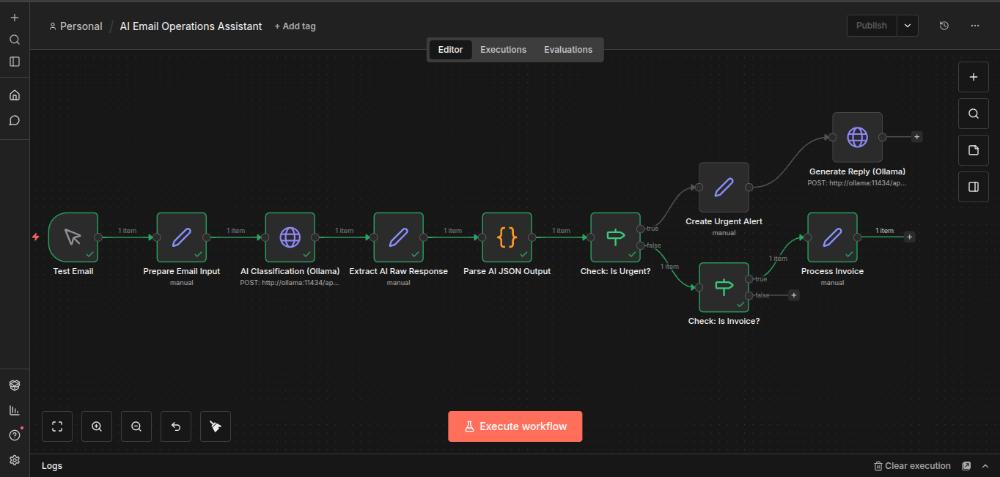

# AI-Powered Email Automation System (Self-Hosted LLM + n8n)

## Architecture Diagram



## Overview

This project is a self-hosted AI-powered email automation system built using:

- Docker
- Docker Compose
- n8n
- Ollama (local LLM)
- JavaScript (JSON parsing & transformation)

The system classifies incoming emails using a locally hosted language model and routes workflows dynamically based on urgency and category.

It demonstrates AI agent orchestration and workflow automation without relying on external APIs.

---

## Features

- AI-based email classification (urgent / invoice / client / spam)
- Structured data extraction:
  - priority
  - short summary
  - action required
- Conditional routing logic
- Automated urgent alert generation
- AI-generated reply drafts
- Fully self-hosted (no OpenAI dependency)
- Dockerized architecture

---

## Architecture

Manual Trigger (Test Email)  
→ Prepare Email Input  
→ AI Classification (Ollama)  
→ Extract AI Raw Response  
→ Parse AI JSON Output  
→ Conditional Routing  
  → Urgent → Create Alert + Generate Reply Draft  
  → Invoice → Process Invoice  
  → Other → End  

---

## Tech Stack

- Docker
- Docker Compose
- n8n
- Ollama
- llama3.1:8b model
- JavaScript (Node.js inside n8n)

---

## How to Run Locally

Clone the repository:

```bash
git clone https://github.com/YOUR_USERNAME/ai-email-operations-assistant.git
cd ai-email-operations-assistant
```

Start services:

```bash
docker-compose up -d
```

Pull the LLM model:

```bash
docker exec -it ollama ollama pull llama3.1:8b
```

Open n8n:

http://localhost:5678

Import the workflow JSON from the `workflows/` folder.

---

## Why This Project

This project demonstrates:

- Designing structured automation workflows in n8n
- Integrating self-hosted AI models into automation pipelines
- Converting unstructured text into structured business logic
- Conditional workflow routing
- Containerized deployment architecture

---

## Future Improvements

- Live Gmail inbox trigger
- Slack / Telegram integration
- Logging to database
- Error handling workflow
- Production deployment on VPS

---

## Author

Revanth

